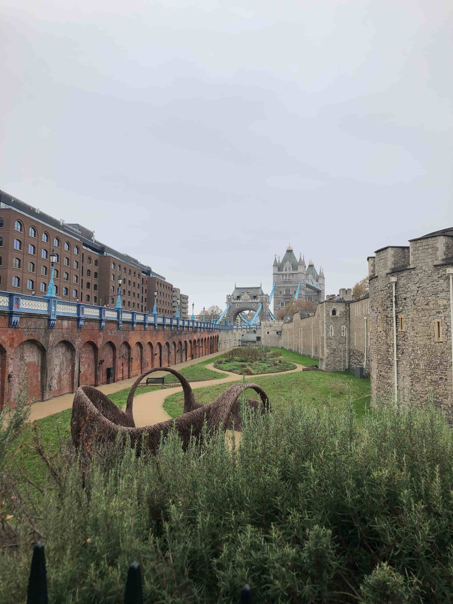
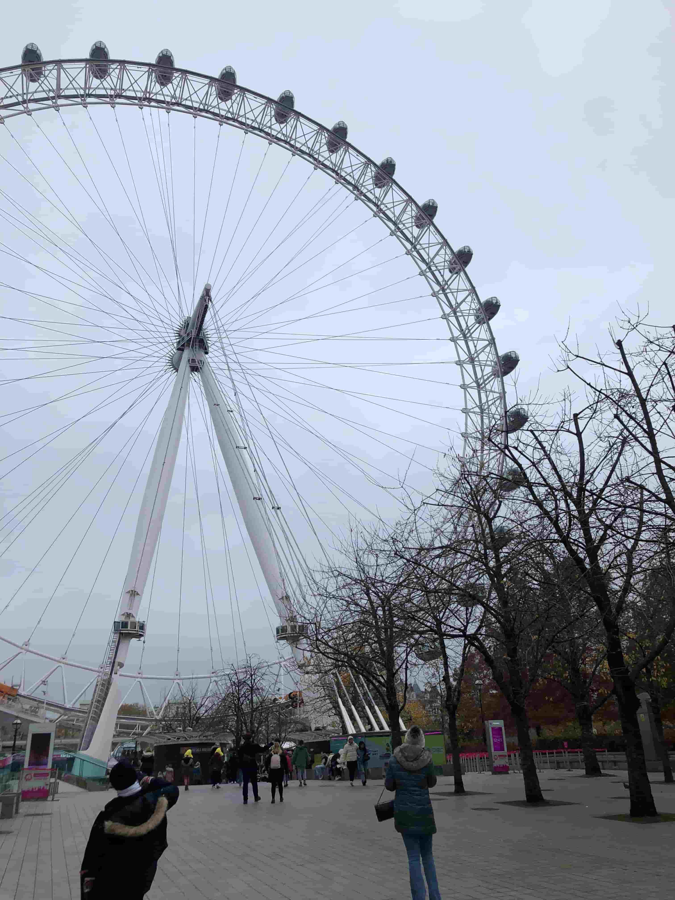
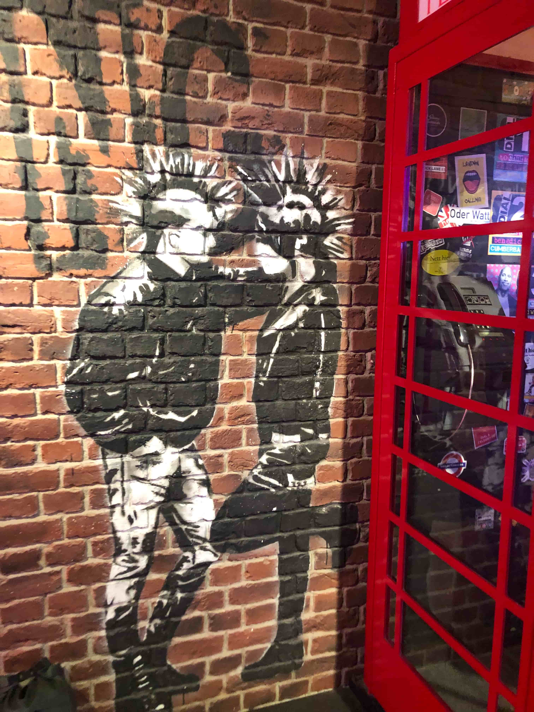
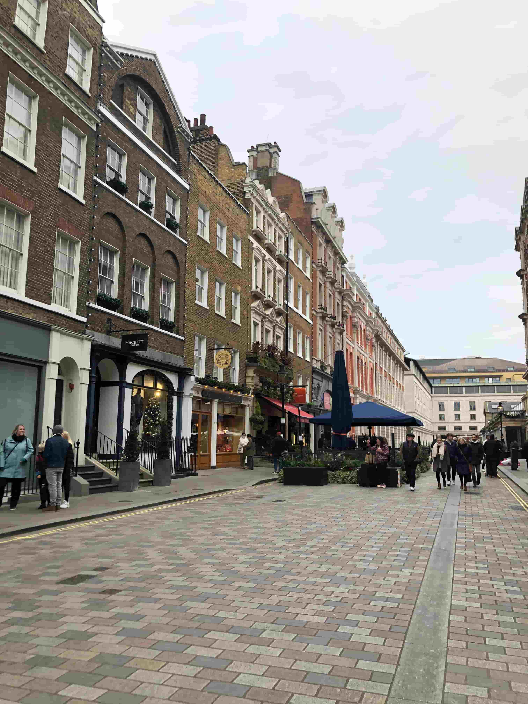

+++
title = "Mein London Kurztrip"
date = "2023-12-04"
draft = false
pinned = false
image = "img_5350-2.jpg"
+++
Letzte Woche war ich für ein paar Tage in London. Um genau zu sein, 2 Tage vor Ort und 2 für die Reise. 

Ich habe als Projekt eine Reise nach London geplant, was ich zum Anfang allerdings nicht gewusst habe: Dass diese Reise dann tatsächlich stattfindet. 

Ich bin mit meiner Gotte und ihrem Freund gereist. Getroffen haben wir uns in Olten und sind dann von dort über Basel nach Paris gefahren (ca. 4h Fahrt). In Paris hatten wir dann 3 1⁄2 h Aufenthalt. Wir haben uns den Eiffelturm angesehen und sind dann zum Bahnhof gelaufen. (Wir sind an einem anderen Bahnhof angekommen, als es weiter ging). Was wir allerdings nicht gewusst haben, dass wir für den Zug auf London, 60-90 min vor Abfahrt des Zuges dort sein mussten. Denn man musste wie am Flughafen boarden und durch die Sicherheitskontrolle gehen. So haben wir dummerweise den Zug verpasst. Wir kamen trotz warten auf den nächsten Zug, in London an (nach ca. 3h Fahrt). 

In London waren wir die meiste Zeit zu Fuss oder mit der U-Bahn unterwegs. 

Was wir alles gesehen haben:

* Weihnachtsmärkte
* London Eye 
* Big Ben 
* Buckingham Palace & Wachablösung
* Tower Bridge 
* Madame Tussaud
* Die berühmten Busse 
* und natürlich die Stadt 

Was mir besonders aufgefallen ist, dass die Leute in London alle sehr freundlich sind. Das hat mich einerseits sehr gefreut und andererseits überrascht, da ich es nicht so krass gewohnt bin. 

Mir hat die Reise hervorragend gefallen, auch wenn wir nur 2 ganze Tage dort hatten. Trotzdem war es sehr anstrengend, diese vielen neuen Eindrücke. 

