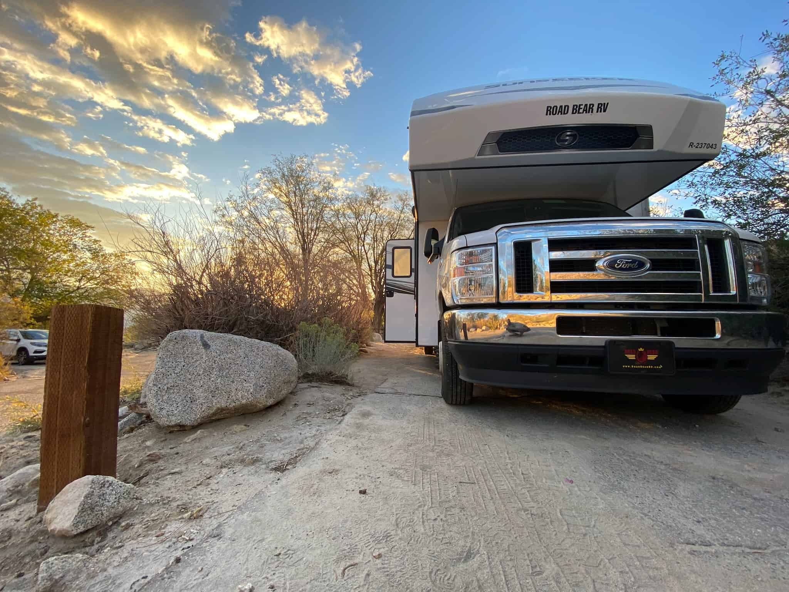
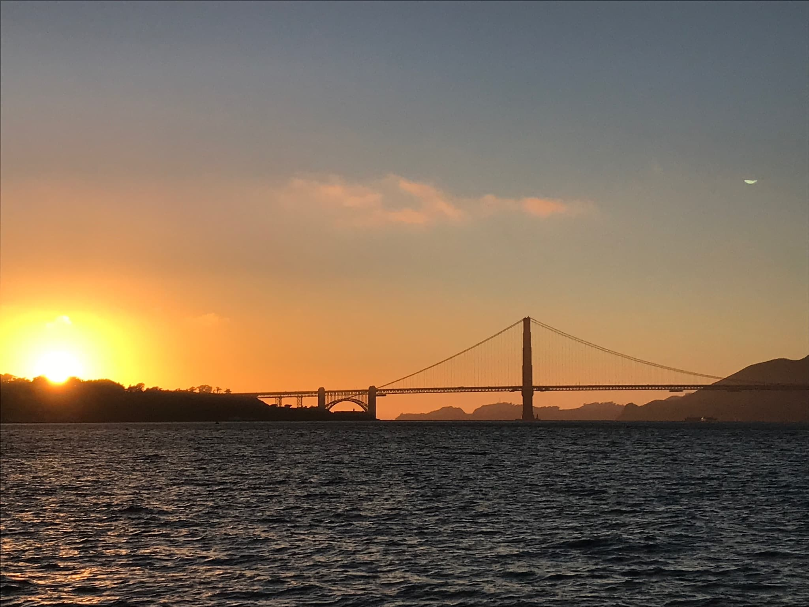
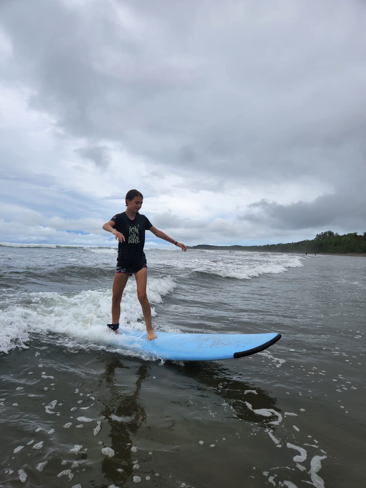
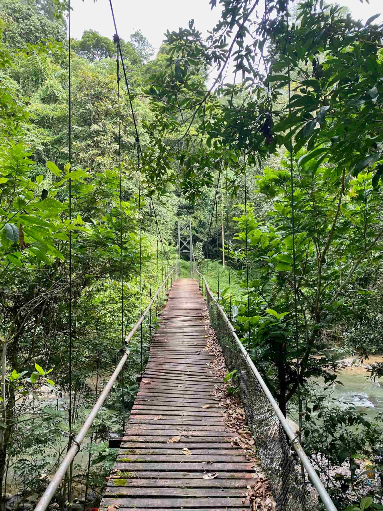

+++
title = "Meine Reisen 2014/2015 und 2022"
date = "2024-01-23"
draft = false
pinned = false
image = "8d5e54d5-924d-415e-8723-06fdb2a8b299.jpeg"
+++
Wir als Familie haben bis jetzt schon zwei grössere Reisen gemacht. Die 1. war, ich glaube 2014/2015, da waren wir zweimal 3 Monate mit dem Segelschiff auf dem Mittelmeer unterwegs. Also wir sind im Sommer in Frankreich gestartet, waren dann 3 Monate unterwegs und haben dann den Winter über in Gstaad verbracht. Im Frühling waren wir dann noch mal 3 Monate auf dem Schiff. In dieser Zeit sind wir, wenn ich mich richtig erinnere, von Rom bis Elba alles der Küste entlanggefahren. Da zumal hatten wir eine Jacht gekauft Namens Arielle diese haben wir dann nach der Reise wieder verkauft. (Jetzt haben wir eine kleine Yolle am Bodensee). An diese Reise kann ich mich nicht mehr so gut erinnern, da ich zu diesem Zeitpunkt 5 Jahre alt war. Was ich aber noch sehr präsent weiss: als ich das Schiff das erste Mal betreten habe, habe ich Folgendes gefragt: "sind wir jetzt in einem anderen Frankreich?" (ein oder zwei Jahre zuvor hatten wir mal Urlaub in Frankreich gemacht). 

Im Sommer 2022 haben wir dann die 2. grössere Reise gemacht. Wir waren zuerst einen Monat in Costa Rica unterwegs. Wir haben dort ein Auto gemietet und haben in Bungalows gewohnt. In Costa Rica haben wir sehr viele Tiere gesehen, also von Ameisen über Schildkröten, Wale, Alligatoren / Krokodile, Tukan, bis hin zum Waschbären war alles dabei. In der zweiten Woche waren wir drei Nächte in einem Einheimischen Dorf. Diese haben uns gezeigt, wie sie leben. Diese hatten keinen Strom oder Licht und gewohnt haben sie in selbst gebauten Hütten. Da wäre mir fast ein Skorpion über die Füsse gerannt. Ausserdem haben wir sonst viele tolle Dinge erlebt, wie z. B. reiten am Strand (obwohl ich das mittlerweile nicht mehr machen würde) oder Surfen war auch ein High light. Auch eine spezielle Erfahrung war, dass ich etwa zwei Wochen lang um 19.00 Uhr im Bett war und um 5.00 Uhr wieder wach war. Einfach, weil die Sonne dort einen ganz anderen Rhythmus hat als hier bei uns. 

Nach einem Monat sind wir dann in die USA geflogen, genauer nach Denver. Dort haben wir dann ein Wohnmobil gemietet und sind so von Denver über Las Vegas bis nach San Francisco gefahren. Unsere Hauptstationen waren allerdings eher die Nationalpärke, wie Zion, Bryce Canyon, Yosemite und Mammoth Lakes. Das Beeindruckende in den USA war die Grösse. Alles war viel ausgeprägter und weiter. Zum Einkaufen konnten wir nicht zu Fuss gehen, wir mussten mit dem Wohnmobil hinfahren. Zum Parken brauchten wir jeweils 4 Parkplätze. Also zwei in der Breite und zwei in der Länge. Ebenfalls eindrücklich war der Walmart, das Einkaufszentrum, dort gibt es wirklich alles in einem Laden. Also von Essen über Kleider bis zur Möbelabteilung war alles dabei. 

Auch in Amerika haben wir viel erlebt und gesehen. Hier war mein liebstes Erlebnis, das Biken in Moab. Ansonsten waren wir viel Wandern und da wir durch das Wohnmobil sehr mobil waren, sind wir eigentlich nie länger als 3 Nächte an einem Ort geblieben und am nächsten Tag hiess es wieder lange fahren. Durch die weite Entfernung fuhren wir an manchen Tagen bis zu 4-5 Stunden und das manchmal war dies nur Wüste (also ziemlich langweilig). In Las Vegas haben wir eine Nacht verbracht. Mir hat es dort nicht sonderlich gefallen, da es zu viele Eindrücke auf einmal waren, das wurde mir zu viel. 

Was mir hervorragend gefallen hat:

* Dass wir so viele Tiere gesehen haben
* Neue Eindrücke sammeln
* Zeit mit der Familie verbringen
* Das Biken und Surfen 

Was für mich schwer war auf dieser Reise:

* Ich hatte sehr wenig Rückzugsort
* Ich habe die Pferde und das Reiten sowie meine Freunde vermisst
* Ich war einmal krank in dieser Zeit
* Das Autofahren hat mir ein wenig Mühe gemacht (obwohl das Zuhause kein Problem ist)

