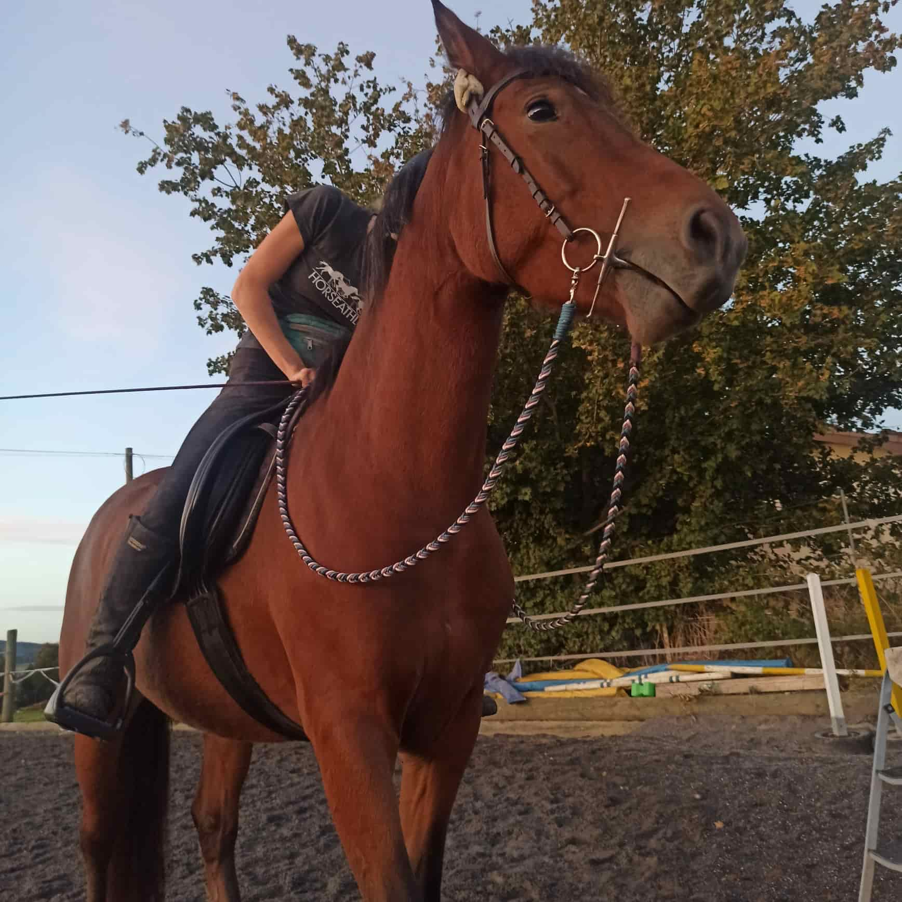

+++
title = "Selbstgemachte Zügel "
date = "2023-09-14"
draft = false
pinned = false
image = "8a4f9abd-1572-4256-a9ea-ee2fe49b368e.jpg"
+++

Aus insgesamt 40 m Schnur habe ich Zügel geknüpft. 

Ich habe 4 PP-Seile, je in der Länge von 10 m, gekauft und mit der Anleitung von Nordfalben angefangen zu flechten. Der Anfang war etwas schwer, denn wenn man kein Video, sondern nur ein Bild und ein wenig Text hat, war es nicht ganz einfach zu verstehen, wie das Flechtmuster funktioniert. Als ich nach eine Zeit dann herausgefunden habe, wie das funktioniert, habe ich mich daran gesetzt, um insgesamt 3 m Zügel zu flechten. Als ich ca. bei 2 m war, habe ich bemerkt, dass es nicht mehr so schön eng ist, egal, wie viel ich anziehe. Ich habe dann probiert, herauszufinden, weshalb das so ist. Ich habe dann gesehen, dass ich ca. in der Hälfte einen Fehler gemacht habe. Das war ein kleines Down in meiner Arbeit, habe mich aber trotzdem dazu entschlossen den noch einmal zu öffnen und es schön und sauberzumachen. Nach einiger Zeit Arbeit hatte ich meine 3 m und ich kam zum Schluss, was mich auch noch einmal vor eine Herausforderung stellte. Es war gar nicht so leicht, dieser Karabiner am Ende anzubringen.

Fazit: Es hat mir unheimlich viel Spass gemacht, die Zügel zu machen. Ich werde in Zukunft auf jeden Fall wieder ein Zubehör aus PP-Seilen für die Pferde machen.