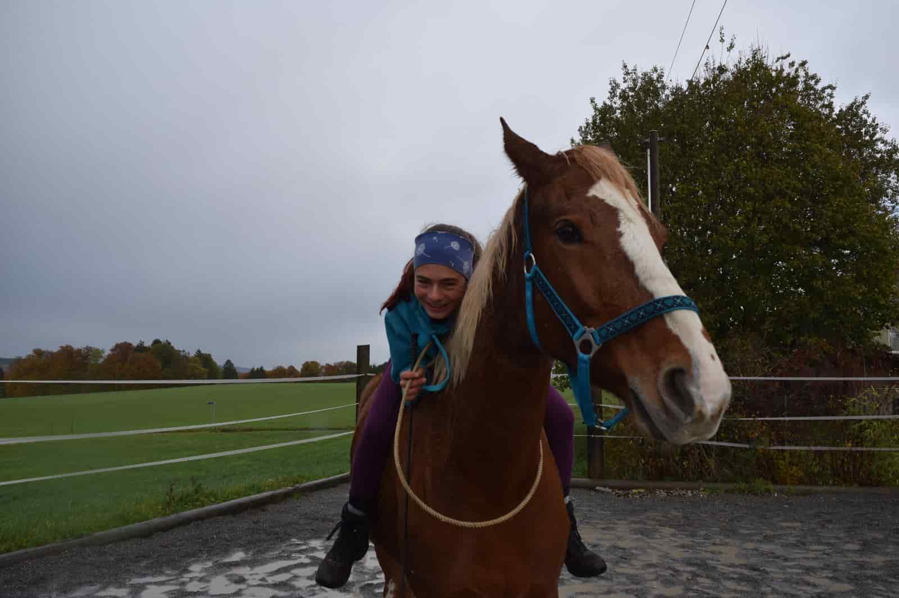
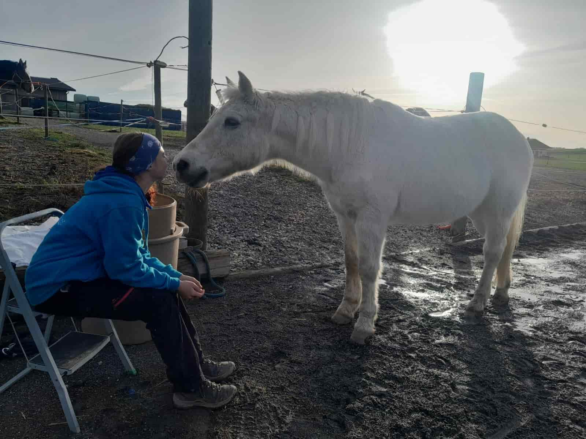
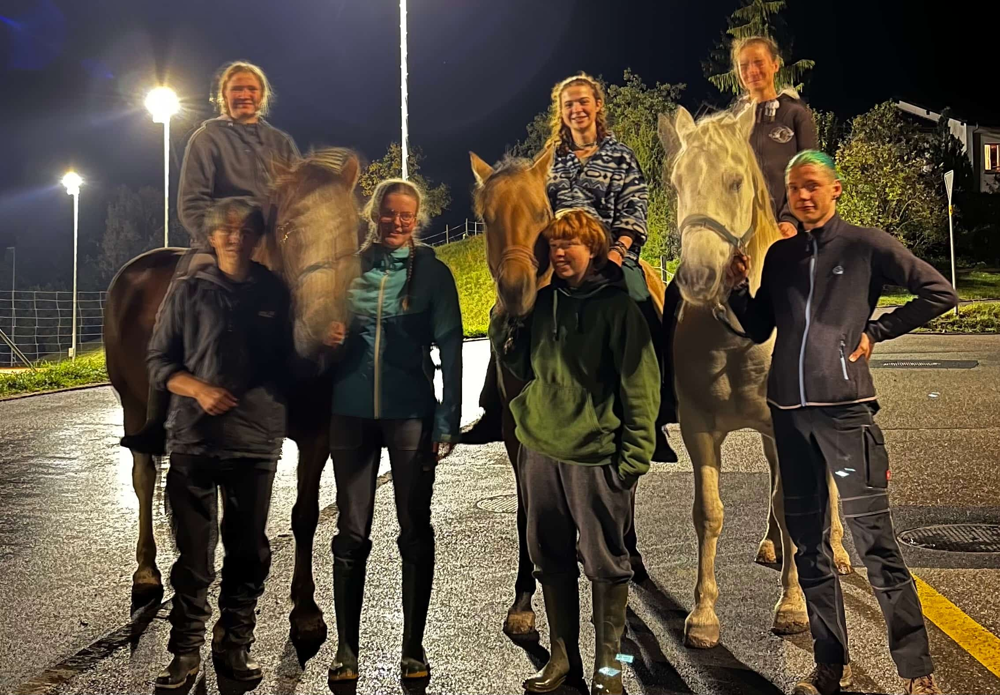
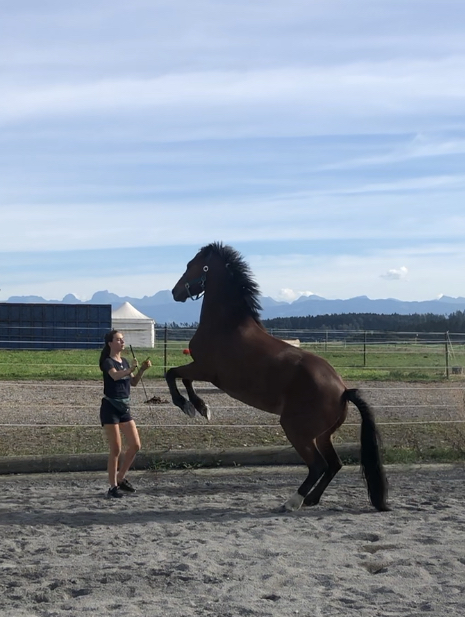

+++
title = "Warum Pferde mein Leben sind."
date = "2023-12-19"
draft = false
pinned = false
image = "bdbca07e-4678-4b09-81fc-e3c6a0f4ce8a.jpg"
+++
Seit 6 Jahren reite ich in der Reitstunde. Mittlerweile ist es mehr als nur das. Es ist zu einer Leidenschaft geworden, die mich durch mein ganzes Leben begleitet. 

Es beginnt damit, dass ich am Morgen beim Aufwachen die Bilder und Fotos von den Pferden an meiner Wand sehe. Danach beim Anziehen (die Hälfte meiner T-Shirts und Pullis sind vom Hof, wo ich reite oder von Horseathlon). Später beim Arbeiten habe ich Pferde als Hintergrund von meinem Computer und am Nachmittag bin ich oft bei den Pferden. Sie sind ein fester Bestandteil von mir, der mich auszeichnet und glücklich macht. 

Nehmen wir an, ich hätte als kleines Mädchen ins Ballett gewollt. Wer wäre dann jetzt meine beste Freundin? Was würde ich an den Nachmittagen machen? Worauf würde ich mich immer freuen? Und wie würde mein Leben aussehen? 

Das sind solche Fragen, die ich mir manchmal stelle. Mein Leben würde komplett anders Aussehen nur wegen einer Entscheidung. 

Ich bin aber sehr glücklich, wie es jetzt ist, und bin froh, dass ich bei den Pferden gelandet bin. Diese Tiere haben mir so viel gebracht. 

In den letzten Jahren hat sich so viel getan und wenn ich genau überlege, kann ich fast alles auf die Pferde zurückverfolgen. 

* Ich habe eine wunderbare Freundesgruppe (Alle reiten). 
* Ich bin selbstbewusster geworden (durch die Arbeit mit den Pferden)
* Habe gelernt, Verantwortung zu übernehmen (drei tolle Pferde, um die ich mich kümmere, Arbeit im Stall und Lagerleitung)
* Ich bin viel draussen bei jedem Wetter und bin somit ziemlich Wetterfest.
* Mein Alltag besteht aus viel Bewegung.

Es ist etwas, was mich einfach glücklich macht. Pferde sind Tiere, die nicht nachtragend sind, sie verzeihen dir Fehler und du lernst daraus. Es ist das schönste, wenn dir ein Pferd sein Vertrauen schenkt und motiviert ist, mit dir zu arbeiten und Spass zu haben. 

Es ist dieser Ort, diese Leute und diese Tiere, die mich zum Lachen bringen, mich trösten, wenn ich traurig bin oder ich den grössten Quatsch erleben kann. Es ist der Ort, an dem mein Lachen zu 100 % echt ist und ich, ich sein kann. Egal, mit welchen Ecken und Kanten, ich werde so akzeptiert, wie ich bin.

Und genau dafür bin ich so unglaublich Dankbar!!!!!

