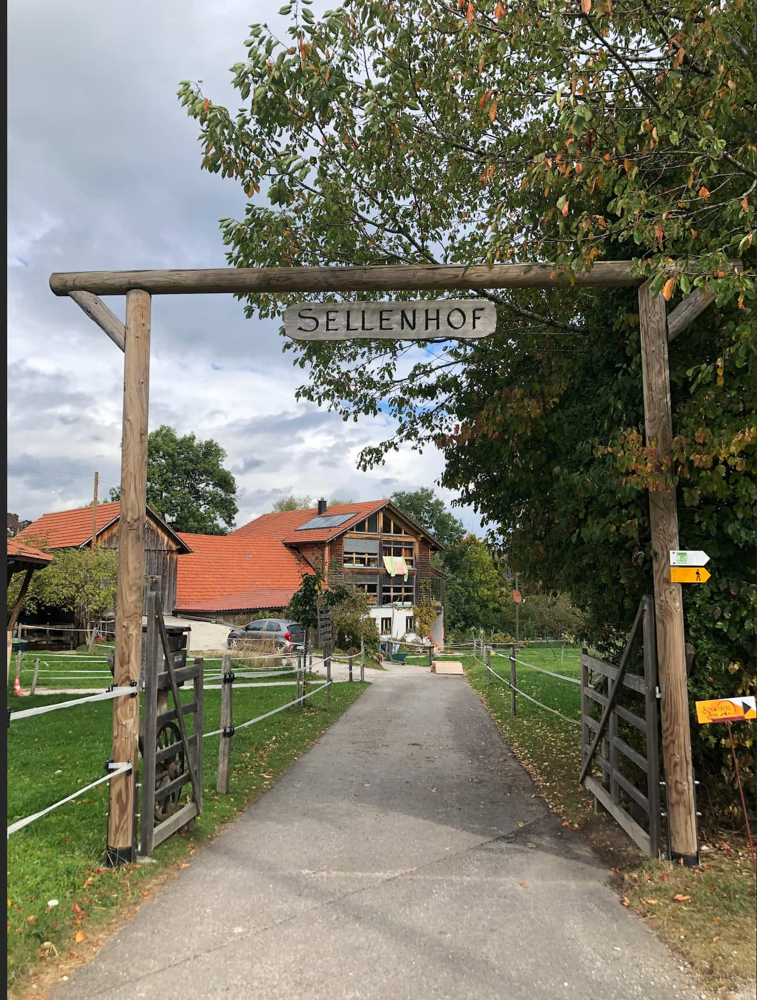
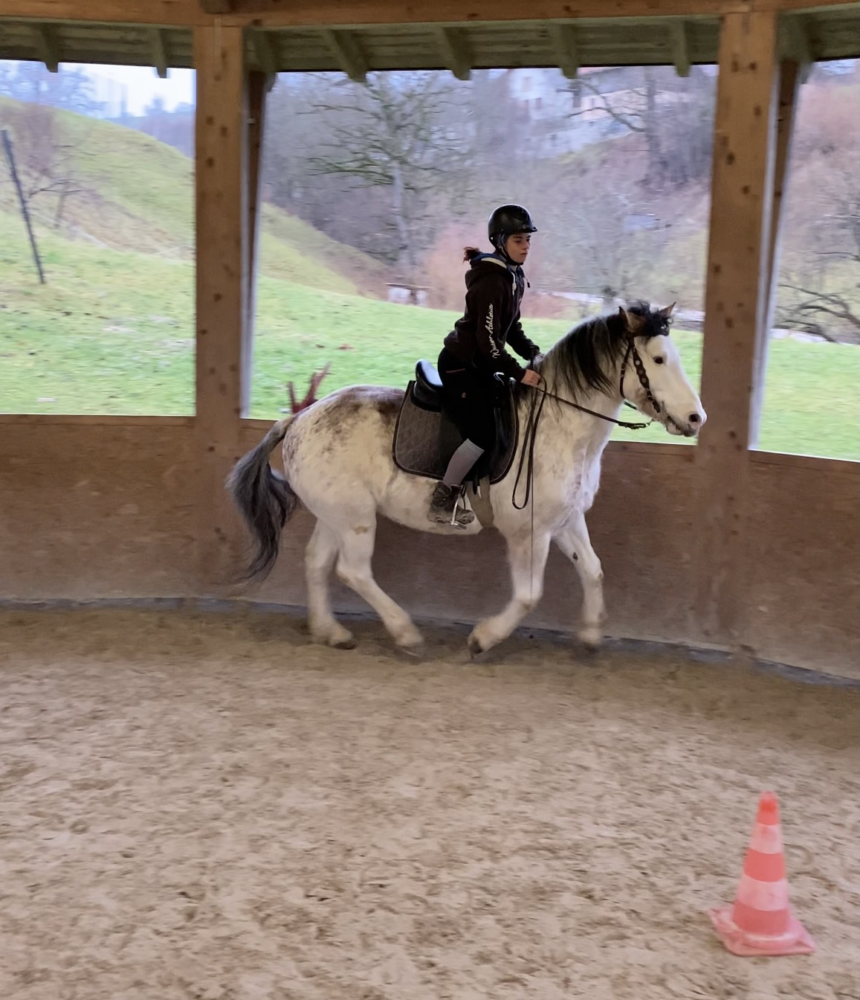

+++
title = "Was jetzt?"
date = "2024-01-22"
draft = false
pinned = false
image = "625868d3-1892-411b-811c-26533490555b.jpeg"
+++
Lange war die Idee, dass ich nach der Schule die Praktika machen und im Sommer 2025 die Lehre auf dem Sellenhof starten würde. Amea hat dann allerdings die Lehrstelle für den Sommer 2024 angeboten bekommen. Für mich war von Anfang an klar, dass ich die Stelle nehmen werde, wenn sie es nicht macht. 

Amea's Entscheidung steht jetzt fest. Somit kann ich die Lehrstelle nun haben, wenn ich das möchte. Sie vom Hof haben mich inzwischen noch einmal gefragt, wie es aussieht. Meine Antwort war klar, dass ich die Lehrstelle noch möchte. Jetzt haben wir diesen Freitag ein Gespräch zusammen mit meinen Eltern und dem Hof, um zu schauen, wie es jetzt weitergeht. Ich bin sehr glücklich, dass es für mich klar ist, wie es weitergeht. Denn einen Praktikumsplatz hätte ich bisher nicht gehabt, und es war sehr anstrengend und vor allem schwer, einen geeigneten Hof zu finden.

